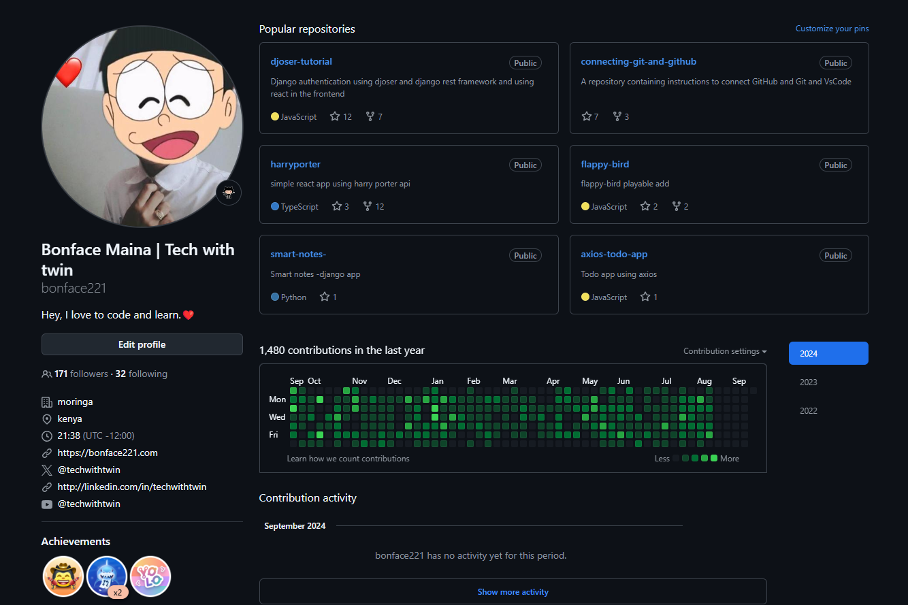

## Hey :wave:, I'm Bonnie

 

<h3> &nbsp;👩🏾‍💻 About Me </h3>

I'm a software development student passionate about solving complicated problems and creating web software solutions. I heart Open Source, and therefore, I take great pleasure in working on interesting open-source projects.

- 🎥 I’m currently building: **Fullstack web apps**

- 🌱 I’m currently learning: **Azure AI Services, AWS Amplify, PHP and Go**

- 🎥 I’m building next and react applications.

- 🤝 I’m looking for open-source projects to work on

- 💬 Ask me about **Git, React, Next, AI tools, Getting the Software Engineering Job**

<h3 align="left">My Github Stats:</h3>

<table >
  <tr>
    <td>
      <a href="https://github.com/techwithtwin">
    </td>
    <td>
       
    </td>
    </td>
    <td>
      
    </td>
  </tr>

</table>

## Links

<h3 align="left">Why is the Account new?:</h3>

Because the previous github account was closed unceremoniously, without any explanation😶 (bonface221)

